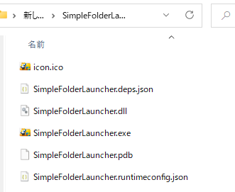
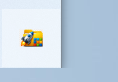
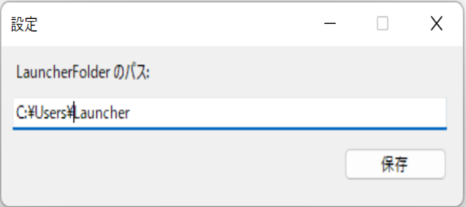

# SimpleFolderLauncher (シンプルフォルダランチャー)

Windowsフォルダをそのまま使える、超軽量・超高速フォルダランチャー

Windows の任意のフォルダを “そのままランチャー” として利用できる、
超軽量・超高速・設定不要のフォルダランチャー です。

Windows 11 で「フォルダをタスクバーにピン留めできなくなった問題」を解決するために作成しました。  
また、使い始めるまでに必要な設定が1つしかないため忙しくて時間がない人にこそ使い始めてほしいツールです。
すでにタスクバーにピン留めしていたフォルダがあれば、そのままこのランチャーで使用することができます。

本ソフトウェアはフリーソフトですので無料で使用することができます。

### 画面動作
     

### 動作環境
Windows 11

## 使い方（クイックスタート）
0. 下記から最新バージョンをダウンロードし、任意の場所に解凍します 
   https://github.com/takuyash/SimpleFolderLauncher/releases  

     

1. exe を実行するとタスクトレイに常駐します  
     

2. タスクトレイのアイコンを右クリックして、設定画面が開けます  
   ランチャーに表示したいフォルダのパスを設定します。  
   1つのフォルダによく使うアプリやフォルダ、ファイルのショートカットを集めて置き、そのフォルダのパスを設定してください。  
     
   
3. Shift 2回連続 もしくは Ctrl + Shift + i のショートカットでランチャーを呼び出すことができます  
     

4. 表示された項目のキー（0-9 / A-Z）を押すだけでフォルダを開けます

## 起動方法
・exeを実行すると、タスクトレイに常駐します。  
・タスクトレイのアイコンを右クリックして、設定画面が開けます。  
・ランチャー画面は、Shift 2回連続 もしくは Ctrl + Shift + i で表示できます。

詳細な手順は下記に記載。  
https://takuyash.github.io/SimplefolderlauncherSite/docs.html

## 特徴
1. 設定不要。フォルダ構造がそのままランチャーとなる  
お気に入りフォルダをエクスプローラーで作るだけでランチャーに自動反映されます。  
そのため、アプリ側で“登録作業”は1つだけ。  
フォルダのパスを設定するだけで使い始められるため、高速に利用開始することができます。

2. 0–9 + A–Z のキー割り当てで超高速起動
表示された項目には自動で 0〜9、A〜Z のキーが割り当てられます。   
ランチャー表示後は 該当キーを押すだけで即フォルダオープンします。  
そのためキーボードだけで操作が完結します。
また、キーを使わずにオープンすることもできます。
・↑↓でカーソル移動
・マウスでクリックして開く
・エンターで開く

3. Shift 2回連続で簡単に起動
ランチャー画面は、Shift 2回連続 もしくは Ctrl + Shift + i で表示できます。   

4. シンプル高速・軽量動作
・シンプルなUI  
・描画コスト極低  
・ポータブル EXE で動作  
・起動、アイテムクリックが極めて高速  

5. Right-Click メニュー
各項目を右クリックするとパスをコピーできます。  

6. escキーでランチャー画面を閉じる
ランチャー画面を閉じる時もescキーですぐに閉じることができます。

7. アプリの最新版への移行も一瞬
最新版をダウンロードして移行する場合も、フォルダのパスを設定するだけなので高速に使い始めることができます。

## アプリ更新方法
更新時は新しいバージョンをダウンロードして既存フォルダに上書きしてください。  
アップデート方法  
1. SimpleFolderLauncherを終了する  
2. 新しいzipファイルをダウンロード  
3. 既存フォルダに上書きする  
4. 起動する  

## その他
・スタートアップに登録しておくと自動で起動して常駐するので起動忘れの心配がないので設定をお勧めします。
・外部キーボードを使用している場合にテンキー入力する場合は、NumLockをONにしてください。

## 免責事項

本ソフトウェアを使用したことによって生じたいかなる損害についても、
作者は一切の責任を負いません。  
自己責任でご利用ください。

## 応援について

もしこのソフトウェアが役に立ったと感じたら、
GitHub の ⭐ Star や 👀 Watch を付けてもらえるととても励みになります！

フィードバックや Issue も大歓迎です。
