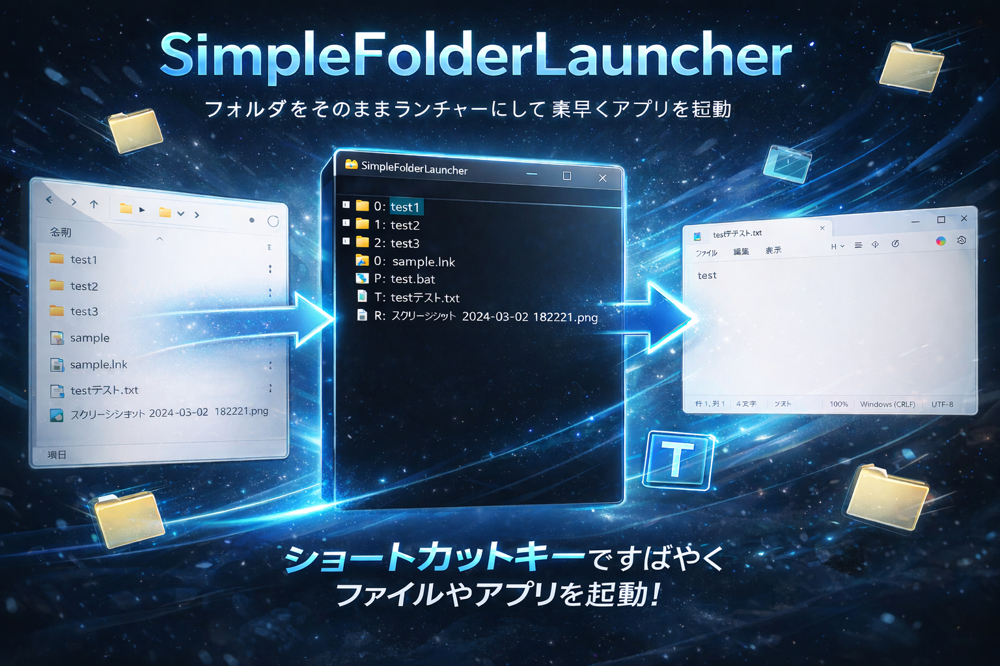
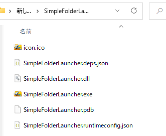
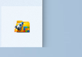
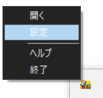
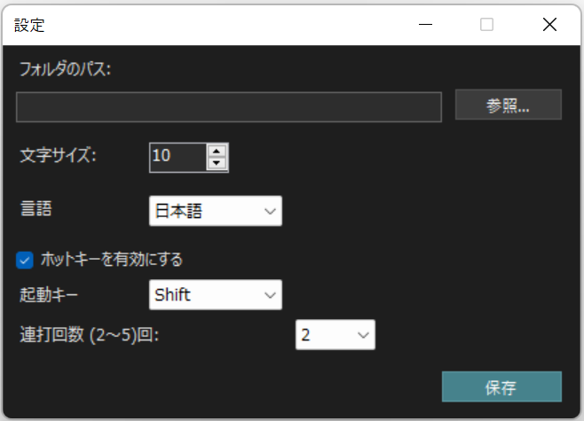
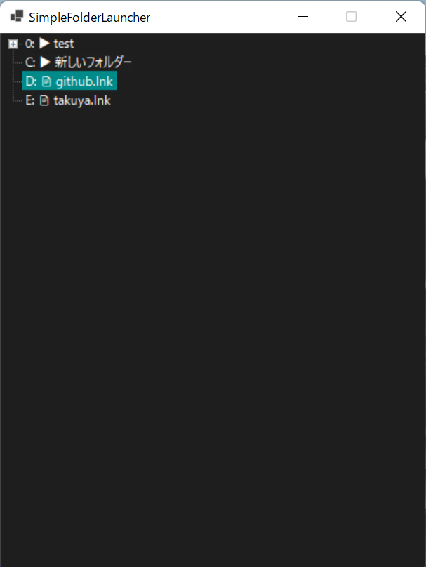
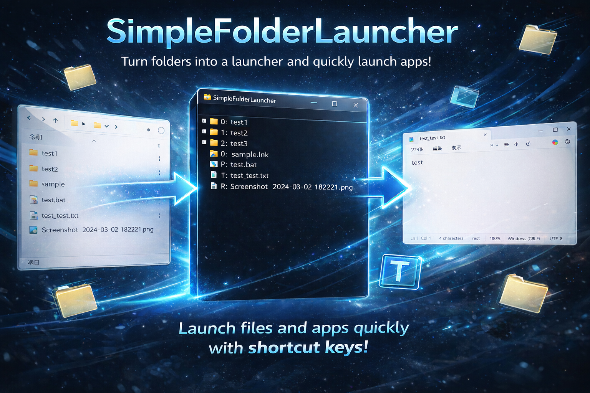
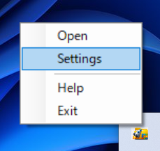
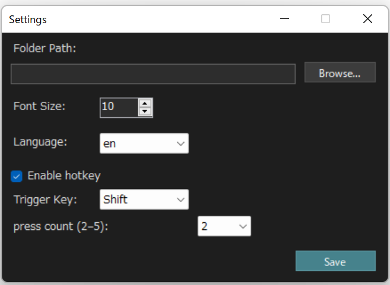

# SimpleFolderLauncher (シンプルフォルダランチャー)

Windowsフォルダをそのまま使える、超軽量・超高速フォルダランチャー

Windows の任意のフォルダを “そのままランチャー” として利用できる、
超軽量・超高速・設定不要のフォルダランチャー です。

Windows 11 で「フォルダをタスクバーにピン留めできなくなった問題」を解決するために作成しました。  
また、使い始めるまでに必要な設定が1つしかないため忙しくて時間がない人にこそ使い始めてほしいツールです。
すでにタスクバーにピン留めしていたフォルダがあれば、そのままこのランチャーで使用することができます。

本ソフトウェアはフリーソフトですので無料で使用することができます。

---

## 画面動作
     
   
---

## コンセプト
     

---

## 動作環境
Windows 11 / Windows 10

---

## プライバシー・入力検知について

本アプリはランチャー起動のホットキー機能のため、キーボード入力イベントを検知します。  
入力された文字内容の保存・送信は行いません。  
個人情報の収集は行いません。  

---

## 使い方（クイックスタート）
0. 下記から最新バージョンをダウンロードし、任意の場所に解凍します 
   https://github.com/takuyash/SimpleFolderLauncher/releases  

     

1. exe を実行するとタスクトレイに常駐します  
     

2. タスクトレイのアイコンを右クリックして、設定画面が開けます  
   言語は日本語と英語が選べるため好きなほうを選んでください。  
     
   ランチャーに表示したいフォルダのパスを設定します。  
   1つのフォルダによく使うアプリやフォルダ、ファイルのショートカットを集めて置き、そのフォルダのパスを設定してください。  
     
   
3. Shift 2回連続 もしくは Ctrl + Shift + i のショートカットでランチャーを呼び出すことができます  
     

4. 表示された項目のキー（0-9 / A-Z）を押すだけでフォルダを開けます

## 起動方法
・exeを実行すると、タスクトレイに常駐します。  
・タスクトレイのアイコンを右クリックして、設定画面が開けます。  
・ランチャー画面は、デフォルトではShift 2回連続 (設定で変更できます)もしくは Ctrl + Shift + i で表示できます。  

詳細な手順は下記に記載  
https://takuyash.github.io/SimplefolderlauncherSite/docs.html

## 特徴
### 1. 設定不要。フォルダ構造がそのままランチャーとなる  
お気に入りフォルダをエクスプローラーで作るだけでランチャーに自動反映されます。  
そのため、アプリ側で“登録作業”は1つだけ。  
フォルダのパスを設定するだけで使い始められるため、高速に利用開始することができます。

### 2. 0–9 + A–Z のキー割り当てで超高速起動  
表示された項目には自動で 0〜9、A〜Z のキーが割り当てられます。   
ランチャー表示後は 該当キーを押すだけで即フォルダオープンします。  
そのためキーボードだけで操作が完結します。
また、キーを使わずにオープンすることもできます。  
・↑↓でカーソル移動  
・マウスでクリックして開く  
・エンターで開く  

### 3. Shift 2回連続で簡単に起動  
ランチャー画面は、Shift 2回連続 もしくは Ctrl + Shift + i で表示できます。  
デフォルトではShiftキー2回連続ですが、キーの種類と回数は設定で変更できます。  
また、ホットキーでの起動のオンオフの変更もできます。  

### 4. シンプル高速・軽量動作  
・シンプルなUI  
・描画コスト極低  
・ポータブル EXE で動作  
・起動、アイテムクリックが極めて高速  

### 5. キーワード検索機能  
キーワードによる検索ができます。

### 6. Right-Click メニュー  
各項目を右クリックするとパスをコピーできます。  

### 7. escキーでランチャー画面を閉じる  
ランチャー画面を閉じる時もescキーですぐに閉じることができます。

### 8. アプリの最新版への移行も一瞬  
最新版をダウンロードして移行する場合も、フォルダのパスを設定するだけなので高速に使い始めることができます。

### 9. 文字サイズの変更も可能  
ランチャー画面の文字サイズを変更することができます。

### 10. 日本語と英語で使用可能  
設定画面で日本語と英語の切り替えが可能です。

### 11. ホットキーのオンオフ/キーの種類、連打回数の変更が可能  
設定画面でホットキーのオンオフ/キーの種類、連打回数の変更が可能です。  

## アプリ更新方法
更新時は新しいバージョンをダウンロードして既存フォルダに上書きしてください。  
アップデート方法  
1. SimpleFolderLauncherを終了する  
2. 新しいzipファイルをダウンロード  
3. 既存フォルダに上書きする  
4. 起動する  

## その他
・スタートアップに登録しておくと自動で起動して常駐するので起動忘れの心配がないので設定をお勧めします。  
・外部キーボードを使用している場合にテンキー入力する場合は、NumLockをONにしてください。  
・Shiftキーを連続で5回以上押すと、Windowsの固定キー機能の確認ダイアログが表示される場合があります。  
  これはOS標準の機能で、本アプリの不具合ではありません。  

## 免責事項

本ソフトウェアを使用したことによって生じたいかなる損害についても、作者は一切の責任を負いません。  
自己責任でご利用ください。

## ライセンス・利用条件

本ソフトウェアはフリーソフトです。  
MIT License のもとで公開されています。  
**個人利用・商用利用を問わず、無料で使用することができます。**
ただし、本ソフトウェアを使用したことによって生じたいかなる損害についても、作者は一切の責任を負いません。  
自己責任でご利用ください。  

## 応援について

もしこのソフトウェアが役に立ったと感じたら、
GitHub の ⭐ Star や 👀 Watch を付けてもらえるととても励みになります！

フィードバックや Issue も大歓迎です。

# SimpleFolderLauncher

An ultra-lightweight and ultra-fast folder launcher that uses Windows folders as-is.

SimpleFolderLauncher allows you to use any Windows folder **directly as a launcher**.  
It is an ultra-lightweight, ultra-fast, and minimal-setup folder launcher.

This tool was created to solve the issue in **Windows 11 where folders can no longer be pinned to the taskbar**.  
Because only a single setting is required to start using it, this launcher is especially recommended for busy users who don’t have time for complicated setup.  
If you already had folders pinned to the taskbar, you can continue using them as-is with this launcher.

This software is **freeware** and can be used at no cost.

---

## Demo

---

## Concept
     

---

## Privacy and Keyboard Input Handling

This application detects keyboard input events solely to enable the launcher hotkey feature.  
No keystroke content is recorded or transmitted.  
No personal information is collected.  

---

## System Requirements
- Windows 11 / Windows 10

---

## How to Use (Quick Start)

0. Download the latest version from the link below and extract it to any location:  
   https://github.com/takuyash/SimpleFolderLauncher/releases  

   

1. Run the `.exe` file and the application will stay resident in the system tray.  
   

2. Right-click the system tray icon to open the settings window.  
   You can select either Japanese or English as the display language.  
     

   Set the path of the folder you want to display in the launcher.  
   Collect shortcuts to frequently used applications, folders, or files into a single folder, and specify that folder’s path.  

   

3. Open the launcher using **double Shift** or **Ctrl + Shift + I**.  
   

4. Press the assigned key (0–9 / A–Z) to instantly open the corresponding folder.

---

## How to Launch
- Running the `.exe` file places the app in the system tray.  
- Right-click the tray icon to open the settings window.  
- By default, the launcher can be opened with **double Shift** (configurable) or **Ctrl + Shift + I**.

Detailed instructions are available here:  
https://takuyash.github.io/SimplefolderlauncherSite/en/docs.html

---

## Features

### 1. No Setup Required — Your Folder Structure Becomes the Launcher
Simply create your favorite folder structure in Windows Explorer, and it will be reflected in the launcher automatically.  
Only one setup step is required: setting the folder path.  
This allows you to start using the launcher immediately and efficiently.

### 2. Ultra-Fast Launching with 0–9 + A–Z Key Assignments
Displayed items are automatically assigned keys from **0–9 and A–Z**.  
Once the launcher appears, pressing the corresponding key opens the folder instantly.  
All operations can be completed using only the keyboard.  

You can also open items using:
- Arrow keys (↑ ↓) to move the cursor  
- Mouse clicks  
- Enter key  

### 3. Easy Activation with Double Shift
The launcher can be displayed using **double Shift** or **Ctrl + Shift + I**.  
By default, it uses double Shift, but both the key type and the number of presses can be changed in the settings.  
You can also enable or disable hotkey activation entirely.

### 4. Simple, Fast, and Lightweight
- Clean and minimal UI  
- Extremely low rendering cost  
- Portable EXE  
- Very fast startup and item launching  

### 5. Keyword Search
Items can be searched by keyword.  

### 6. Right-Click Menu
Right-click an item to copy its path.  

### 7. Close the Launcher with the ESC Key
Press `Esc` to instantly close the launcher.  

### 8. Instant Migration to New Versions
Even when upgrading to the latest version, you can start using it immediately by simply setting the folder path again.  

### 9. Adjustable Font Size
The text size displayed in the launcher can be adjusted.  

### 10. Available in Japanese and English
You can switch between Japanese and English in the settings screen.  

### 11. Hotkey On/Off and Key Configuration
You can enable or disable hotkey activation, change the key type, and adjust the required number of key presses from the settings screen.  

---

## Updating the Application
To update, download the new version and overwrite the existing folder.  

**Update steps:**
1. Exit SimpleFolderLauncher  
2. Download the new ZIP file  
3. Overwrite the existing folder  
4. Launch the application  

---

## Notes
- It is recommended to register the app in Windows Startup so it launches automatically and is always available.  
- When using an external keyboard, make sure **NumLock** is ON to use the numeric keypad.  
- Pressing the Shift key five times or more may trigger the Windows Sticky Keys confirmation dialog.  
  This is a standard Windows feature and **not a bug** in this application.  

---

## Disclaimer
The author assumes no responsibility for any damages resulting from the use of this software.  
Use at your own risk.  

---

## License and Terms of Use
This software is freeware.  
It is released under the MIT License.  
**It may be used free of charge for both personal and commercial purposes.**  
However, the author assumes no responsibility for any damages that may occur as a result of using this software.  
Please use it at your own risk.  

---

## Support
If you find this software helpful,  
a ⭐ **Star** or 👀 **Watch** on GitHub would be greatly appreciated and very motivating!  

Feedback and issues are always welcome.  
